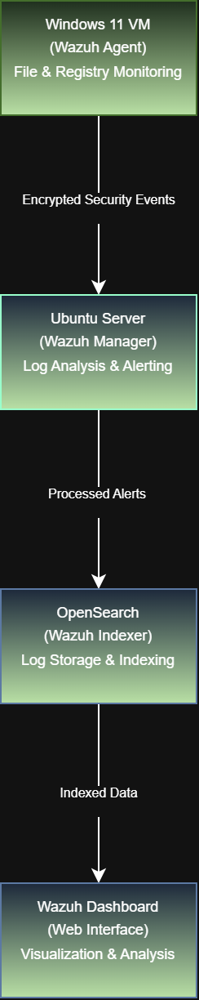

# File-Integrity-Monitoring
This project demonstrates the implementation of File Integrity Monitoring using Wazuh SIEM to detect unauthorized file changes in real time.  The system monitors critical directories and generates alerts for file creation, modification, and deletion.

## Objective
The objective of this project is to implement and demonstrate File Integrity Monitoring (FIM) using Wazuh SIEM to detect, log, and analyze unauthorized changes to critical files and system configurations on a Windows system, enabling improved security monitoring and incident response.

## 🏗️ System Architecture

### 🔹 Component Explanation

The architecture of this File Integrity Monitoring system consists of the following main components:

#### 1. Wazuh Agent (Windows Endpoint)
- Installed on the monitored Windows machine.
- Continuously monitors files, directories, and registry entries using the Syscheck module.
- Detects file creation, modification, deletion, and registry changes.
- Sends collected events securely to the Wazuh Manager.

#### 2. Wazuh Manager (Ubuntu Server)
- Acts as the central processing unit of the SIEM system.
- Receives security events from agents.
- Analyzes logs using predefined rules and decoders.
- Generates alerts based on file integrity violations.

#### 3. Filebeat
- Collects alerts and logs generated by the Wazuh Manager.
- Forwards them to OpenSearch for indexing and storage.
- Ensures reliable and real-time log transmission.

#### 4. OpenSearch (Indexer)
- Stores and indexes security events and alerts.
- Enables fast searching and filtering of file integrity data.
- Supports visualization and analytics.

#### 5. Wazuh Dashboard
- Provides a web-based interface for monitoring.
- Displays File Integrity Monitoring alerts and statistics.
- Allows filtering, searching, and analysis of security events.

#### 6. Administrator / Analyst
- Accesses the dashboard to monitor system integrity.
- Investigates suspicious file or registry changes.
- Takes corrective actions if needed.

### 🔹 Data Flow Description

The data flow in the File Integrity Monitoring system follows a structured pipeline:

1. The Wazuh Agent continuously monitors configured files, folders, and registry paths on the Windows endpoint.

2. When a change occurs (create, modify, delete, or registry update), the Syscheck module detects the event in real time.

3. The detected event is packaged into a security log and sent securely to the Wazuh Manager.

4. The Wazuh Manager analyzes the incoming log using decoders and rules to determine its severity.

5. If the event matches a File Integrity Monitoring rule, an alert is generated.

6. Filebeat collects the generated alert from the Wazuh Manager.

7. Filebeat forwards the alert to OpenSearch over a secure connection.

8. OpenSearch indexes and stores the event for fast querying.

9. The Wazuh Dashboard retrieves indexed data from OpenSearch.

10. The Administrator views and analyzes the alerts through the dashboard interface.

## Technologies Used

- Wazuh SIEM (Manager, Agent, Dashboard)
- OpenSearch (Indexer)
- Filebeat (Log Forwarding)
- Ubuntu Linux (Wazuh Server)
- Windows 11 (Monitored Endpoint)
- VirtualBox (Virtualization Platform)
- Draw.io (Architecture Diagram Tool)
- Git & GitHub (Version Control)

### Skills Learned
[Bullet Points - Remove this afterwards]

- Advanced understanding of SIEM concepts and practical application.
- Proficiency in analyzing and interpreting network logs.
- Ability to generate and recognize attack signatures and patterns.
- Enhanced knowledge of network protocols and security vulnerabilities.
- Development of critical thinking and problem-solving skills in cybersecurity.

## Steps
drag & drop screenshots here or use imgur and reference them using imgsrc

Every screenshot should have some text explaining what the screenshot is about.

Example below.

*Ref 1: Network Diagram*
